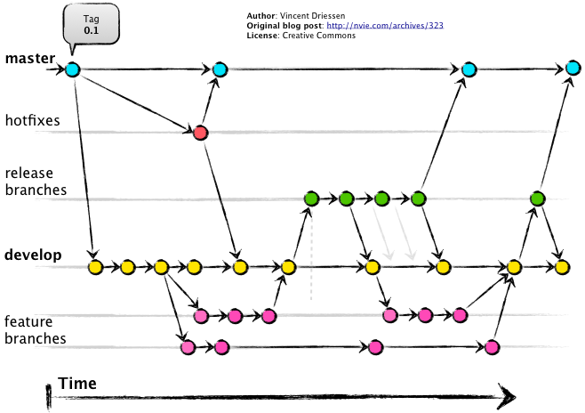
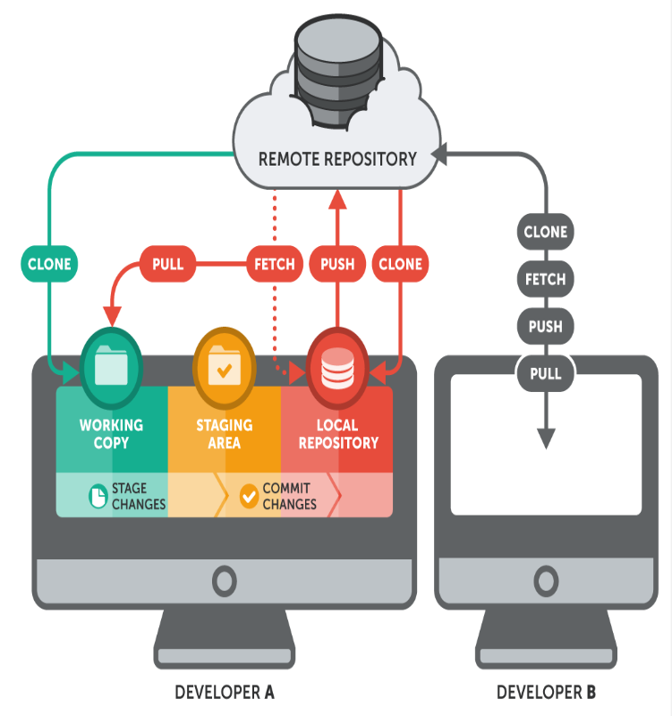

## giơi thiệu git và github

-   git và github khác nhau.

## flow github

## kiểm tra version git

-> $ git --v

## git config:

-> $ git config --g user.name "Dev name"
-> $ git config --g user.name "Dev name"

## kiểm tra lại thông tin config:

-> $ git config --list

## khởi tạo repository local

-> $ git init

## Liên kết đến remote repository (local & GitHub)

-> $ git remote add origin https... <url>

## Thay đổi địa chỉ của remote repository đã Liên kết vào địa chỉ của <new url>

-> $ git remote set-url <name> <new url>

## Thay đổi tên của remote repository đã Liên kết

-> $ git remote rename <old> <new>

## thay đổi branch main (không khuyến khích dùng)

-> git branch -M main
**note: khi làm việc không nên push code trực tiếp lên nhanh main or master mà nên tạo 1 branch mới**

## kiểm tra trại thái repository

-> $ git status

-   câu lệnh này sẽ (Kiểm tra trạng thái của kho lưu trữ)
    giải thích:
    -?? - Tập tin không bị theo dõi
    -A - Tệp được thêm vào giai đoạn
    -M - Tệp đã sửa đổi
    -D - Các tệp đã xóa

## thêm file mới vào repository

-> $ git add . (Chú ý dấu chấm)  
-> $ git add --all (git add -A) (giống cái trên thôi khác cái viết hoa)
-> $ git add <đường dẩn file> ->> thêm file chỉ định

## git commit (câu lệnh quan trong nhất)

-> $ git commit -m "Thông điệp của bạn"

-   Git commit: Ghi lại các thay đổi vào kho lưu trữ. (Cần thêm các thông điệp rõ ràng vào mỗi mục commit)
-   Cách đặt tên branch hay commit nên rõ ràng, thể hiện branch đó, commit đó thực hiện feature gì hay là fix bug gì... (thường thì sẽ theo quy định của công ty)

## Xem lịch sử làm việc với git (lịch sử commit)

-> $ git log

## So sánh sự khác biệt kể từ lần commit cuối cùng của bạn

-> $ git diff

## đẩy code lênh repository github

-> $ git branch -M branch_mane
**note: không được đẩy code trực tiếp vào branch default**

## Kiểm tra các nhánh hiện có của bạn ở local

-> $ git branch

## Tạo một nhánh có tên “branch_mane” và hợp nhất (merge) nó với nhánh chính

-> $ git branch -c branch_mane
-> $ git checkout -b branch_mane
**note: lệnh này sẽ copy code ở branch hiện tại sang branch mới**

## - Xóa một nhánh tại local có tên: "branch_mane"

-> $ git branch -d branch_mane
**note:branch đã được hợp nhất (push) vào remote repository**
-> $ git branch -D branch_mane
**note:branch đã commit nhưng chưa hợp nhất vào remote repository**

## kiểm tra các branch hiện có

-> $ git branch -a

## Lệnh trên giúp di chuyển không gian làm việc

-> $ git checkout branch_mane

## tạo và chuyển sang branch mới

->$ git checkout -b branch_mane

## Lấy code về nhưng chưa muốn merge

-> $ git fetch origin
+Git fetch cho phép CẬP NHẬT để xem điều gì đã thay đổi trên GitHub của bạn.
Lệnh fetch (xác nhận nội dung thay đổi trong branch của remote repository) nhưng nội dung branch của local repository không bị thay đổi.

## merge kết hợp nhánh hiện tại, với một nhánh được chỉ định

-> $ git checkout branch_mane1

-   tiến hành hợp nhất
    -> $ git merge branch_mane2
-   note:Nhánh chỉ định hợp nhất
    (Nhánh hiện tại là nhánh bạn đang đứng, nhánh chỉ định là nhánh sau lệnh $ git merge)

Lệnh trên giúp hợp nhất các branch (Hợp nhất branch_mane2 vào branch_mane1). (Chú ý xử lý xung đột code)

### Hợp nhất từ xa

## Git pull kéo tất cả các thay đổi từ main về local

-> $ git pull origin main

## Git pull kéo tất cả các thay đổi từ branch_mane về local.

-> $ git pull

## Git pull kéo tất cả các thay đổi từ kho lưu trữ từ xa vào branch bạn đang làm việc. (pull là sự kết hợp của 2 lệnh khác nhau: fetch và merge)

-> $ git pull origin

## Cach pull chống xung đột

-> $ git pull --rebase

## Lưu lại công việc đang làm ở branch này để chuyển sang branch khác (Khi bạn chưa muốn commit code)

->$ git stash save # Hoặc $ git stash

## Xem lại lịch sử thay đổi

->$ git stash list

## Xem lại lịch sử thay đổi cụ thể của lần stash save{n}.

-> $ git stash show stash@{n}

## Apply thay đổi của lần stash save{n}.

-> $ git stash apply stash@{1}

## Xoá toàn bộ stash.

-> $ git stash clear

### Tổng quan một quy trình làm việc với Git

Tất nhiên rồi! Đối với những proDev, lỡ có quên... chỉ một dòng lệnh: $ git help -a là lại Ok. Nhưng với những bạn mới dù $ git help -a thì cũng không biết bắt đầu từ đâu? Không biết thực thi dòng lệnh nào trong giai đoạn nào?

Các bạn đừng quá lo lắng, bức tranh tổng quát sau sẽ giúp các bạn phần nào giải tỏa được những băn khoăn đó:

Trong hướng dẫn này, tôi mặc định rằng các bạn đã có cho mình một tài khoản GitHub và thành thạo với việc tạo một kho lưu trữ từ xa (remote repository) trên GitHub nha. (Phần này tạo trên GitHub) Nếu bạn nào chưa tạo được remote repository thì xem lại bài giảng này nhé:

## Quy trình chủ động: (Bạn chủ động triển khai một dự án mới)

##### 2/. Cấu hình Github client để làm việc với máy chủ Github

##### 3/. Khởi tạo repo:

##### 4/. Đưa file từ client lên Github:

## B/. Quy trình bị động: (Bạn được Sếp giao hoặc tham gia dự án cùng Team)

##### Từ bước 1 đến bước 3 (Tương tự như trên)

## flow teamword
